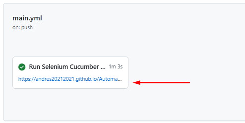

# Automatización Selenium Java BDD Web

Framework de automatización web desarrollado con **Java**, **Selenium WebDriver**, **Cucumber BDD**, **JUnit 5**, **Maven** y **Allure Report**.

El objetivo de este proyecto es automatizar pruebas funcionales sobre la página **Demoblaze**,aplicando buenas prácticas de automatización,
patrón **Page Object Model**, separación de responsabilidades, reportes visuales y evidencia automática cuando una prueba falla.

---

## Tecnologías utilizadas

| Tecnología         | Uso                                          |
|--------------------|----------------------------------------------|
| Java 21            | Lenguaje principal del proyecto              |
| Maven              | Gestión de dependencias y ejecución          |
| Selenium WebDriver | Automatización del navegador                 |
| Cucumber BDD       | Definición de escenarios en lenguaje Gherkin |
| JUnit 5            | Motor de ejecución de pruebas                |
| Allure Report      | Generación de reportes visuales              |
| IntelliJ IDEA      | IDE utilizado para desarrollo                |
| Git / GitHub       | Control de versiones y repositorio remoto    |

## Ejecución local del proyecto

Para ejecutar las pruebas automatizadas de forma local, primero se debe clonar el repositorio y abrir el proyecto en un IDE como **IntelliJ IDEA**.

### 1. Clonar el repositorio

```bash
git clone https://github.com/andres20212021/Automatizacion-Selenium-Java-BDD-Web.git

---

Ingresar a la carpeta del proyecto
cd Automatizacion-Selenium-Java-BDD-Web

Para ejecutar todos los escenarios configurados en el framework, se debe utilizar el siguiente comando:
mvn clean test

Visualizar el reporte Allure localmente
mvn allure:serve 
Este comando genera y levanta automáticamente el reporte Allure en un servidor local, abriéndolo en el navegador

## Ejecución de pruebas de regresión en GitHub Actions

El proyecto cuenta con un pipeline configurado en **GitHub Actions** para ejecutar automáticamente las pruebas de regresión del framework.

Las pruebas de regresión se identifican mediante el tag de Cucumber:

```gherkin
@regression
```
### Ejecución programada

El pipeline también tiene preparada una configuración para ejecución programada todos los domingos a las 12:00 del día, pero actualmente se encuentra comentada en el archivo YAML.

```yaml
# schedule:
#   - cron: "0 12 * * 0"
```

Para activar esta ejecución programada, se deben quitar los comentarios de esas líneas en el archivo:

```text
.github/workflows/main.yml
```

Las pruebas de regresión se ejecutan automáticamente en las siguientes condiciones:

| Condición | Descripción |
|----------|-------------|
| Push a `main` | Se ejecutan cuando se sube un cambio directamente a la rama `main`. |
| Pull Request hacia `main` | Se ejecutan cuando se crea o actualiza una Pull Request apuntando a la rama `main`. |
| Ejecución manual | Se pueden ejecutar manualmente desde la pestaña **Actions** de GitHub. |


# Cómo visualizar el reporte

Una vez finalizada la ejecución de las pruebas de regresión en GitHub Actions, el reporte de resultados se publica automáticamente en GitHub Pages mediante Allure Report.

Para visualizar el reporte, ingrese a la ejecución del pipeline y se visualizara esta imagen.



Luego haga clic en el enlace que se visualiza en la imagen.

Desde esta URL podrá revisar el detalle de los escenarios ejecutados, el estado de cada prueba, los errores encontrados y las evidencias adjuntas, como capturas de pantalla en caso de fallos.

## Sitio bajo prueba

El sitio utilizado para las pruebas automatizadas es:

```text
https://www.demoblaze.com/index.html

